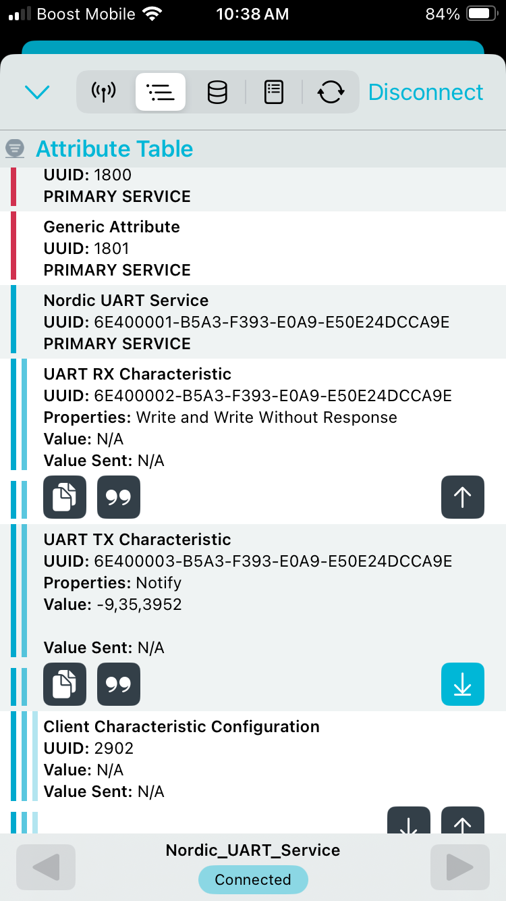

# Zephyr 6 DOF IMU Service
This project was created to explore the NRF Connect SDK and see how sensor data could be transmitted over BLE. A [nRF52832-DK](https://www.digikey.com/en/products/detail/nordic-semiconductor-asa/NRF52-DK/5773879?gclsrc=aw.ds&gad_source=1&gad_campaignid=20243136172&gclid=Cj0KCQiAsY3LBhCwARIsAF6O6XjrvoyaznBkUr3xg7bvg8FZ9HdNwccss0ebOkA51nt_xTl-uCAKZbQaAmY2EALw_wcB) is used with a [MPU6050 breakout board](https://www.amazon.com/MPU-6050-MPU6050-Accelerometer-Gyroscope-Converter/dp/B07RXQGGJX?th=1). 

## IMU Communication
The nRF52-DK communicates with the MPU6050 over I2C. Acceleromter and gyroscope readings are triggered by a rising edge of the `INT` pin on the IMU breakout board. Below is an oscilloscope screenshot of this happening. The purple signal is the `INT` line, and the yellow signal is the `SDA` I2C line.

The MPU6050 is set to be sampled at 100 Hz. To verify this, there is another screenshot below showing that the purple signal has a rising edge every ~10 milliseconds.

## BLE Connectivity

This application acts as a BLE peripheral device. It is possible to connect to it using the NRF Connect smart phone app. It uses the Nordic Uart Service to send the raw accelerometer data as a CSV string like so: `Ax,Ay,Az`. For testing, this was sent once every 500 samples or once every 5 seconds. Below is a screenshot of the data coming in on the app. The transmitted data is in next to `Value` in the `UART TX Characteristic` section.

